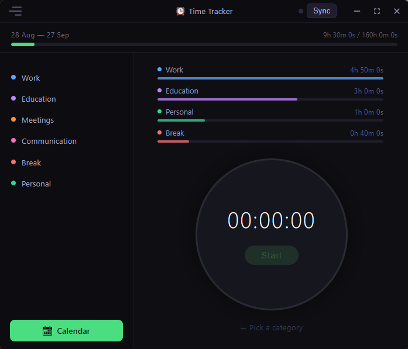

<div align="center">
  <a href="https://github.com/nondeletable/Time-tracker">
    
  </a>
<h2>Time Tracker</h2>
<p>Аккуратный десктоп-трекер времени для сфокусированной работы - соло или вдвоём, с общим месячным лимитом и офлайн-синхронизацией по локальной сети.</p>
  <p>
    <a href="https://github.com/nondeletable/Time-tracker/blob/main/LICENSE"></a>
    <a href="https://github.com/nondeletable/Time-tracker/releases"></a>
    
    
  </p>
  <p>
    <a href="https://github.com/nondeletable/Time-tracker/blob/main/README.md">English </a> |
    <a href="https://github.com/nondeletable/Time-tracker/blob/main/README/README-TT-RU.md">Русский </a>
    <br>
    <br>
    
    <br>
    <br>
  </p>
</div>

## ⏱️ Что делает это приложение

Time Tracker - небольшое десктоп-приложение, которое измеряет, сколько времени вы реально
тратите на работу: по категориям и относительно месячного бюджета часов.

Начиналось оно как инструмент на двоих: два человека в одной домашней Wi-Fi-сети, каждый
считает свою работу, а месячный лимит часов (по умолчанию 160 ч) - общий. Со временем оно
выросло в универсальный трекер, который отлично работает **соло** и превращается в **пару**
только когда вы сами захотите - через создание группы и короткий код.

- Запустили таймер, выбрали категорию, остановили - сессия сохранена.
- Смотрите, как заполняется общий месячный лимит (зелёный → красный при превышении).
- Видите шкалы по категориям и календарь дневных итогов.
- При желании объединяетесь в пару по локальной сети - без облака и аккаунтов.
&nbsp;
&nbsp;

## 🎨 Возможности

- **Большой круглый таймер** со Start / Stop и выпадающим списком категорий; после остановки
  диалог позволяет проверить время, сменить категорию и сохранить (или отменить) сессию.
- **Категории** со своими цветами - пресеты по локали при первом запуске плюс собственные;
  мягкое удаление и восстановление без потери истории.
- **Общий месячный лимит** на весь период (по умолчанию 160 ч) в виде верхней шкалы, которая
  становится из зелёной красной при превышении.
- **Шкалы по категориям** (относительно самой загруженной) с живыми итогами.
- **Календарь** - дневные итоги по каждому пользователю с аватарами, навигация по месяцам,
  выделение сегодняшнего дня.
- **Соло или пара.** По умолчанию соло и полностью офлайн. При желании создаёте группу (ровно
  два человека) и делитесь 6-значным кодом для синхронизации по локальной сети.
- **Защищённая LAN-синхронизация.** Авто-обнаружение по UDP, WebSocket-handshake с проверкой
  кода группы и стабильный per-install ID - устройство без кода отклоняется. Лимит и период
  владельца синхронизируются участнику; дневные итоги синхронизируются в обе стороны для общего
  лимита и календаря.
- **Роли** - `solo` / `owner` / `member`. У участника лимит только для чтения; управляет им владелец.
- **Двуязычный интерфейс (RU / EN)** - определяется по локали ОС, переключается на лету в настройках.
- **Кастомный заголовок окна** - без рамки, перетаскиваемый, с кнопками управления в цвет темы;
  окно можно менять по размеру, оно запоминает размер, позицию и развёрнутое состояние между запусками.
- **Настройки** в одном месте - имя и аватар, лимит и период, категории, ручная правка часов по
  датам, синхронизация и язык.
&nbsp;
&nbsp;

## 😎 Приватность и безопасность

- ✅ Работает **полностью офлайн** - в соло-режиме сеть не используется вообще.
- ✅ Никаких аккаунтов, аналитики и телеметрии.
- ✅ Ваши записи времени хранятся **локально** (SQLite в папке AppData) и переживают переустановку.
- ✅ Объединение в пару - по желанию и только в пределах **локальной сети**, ничего не уходит в облако.
- ✅ Устройство может присоединиться к группе только по точному 6-значному коду.
&nbsp;
&nbsp;

## ⚒ Установка

- Зайдите в **Releases** и скачайте свежий `time-tracker-<version>-setup.exe`.
- Запустите установщик (он создаст ярлык на рабочем столе).
- Откройте **Time Tracker**, введите имя при первом запуске и начинайте отсчёт.
&nbsp;
&nbsp;

## 🏓 Как пользоваться

1. Выберите **категорию** и нажмите **Start**. Нажмите **Stop**, когда закончите.
2. В диалоге сохранения подтвердите время и категорию, затем **Save**.
3. Смотрите, как обновляются **общий лимит** и **шкалы по категориям**.
4. Откройте **Календарь** для просмотра дневных итогов.
5. Хотите работать в паре? Откройте **Настройки → Синхронизация**, **Создайте группу** и
   поделитесь кодом. Второй человек выбирает **Присоединиться** и вводит код - вы синхронизированы
   по локальной сети.

<p align="center">
  
</p>
&nbsp;
&nbsp;

## 💾 Технологии

- **Electron** - десктоп-оболочка
- **Vanilla HTML + CSS + JavaScript** - интерфейс (без сборщика)
- **sql.js** - SQLite, скомпилированный в WebAssembly (без нативной сборки)
- **ws** - WebSocket-синхронизация по LAN, встроена в main-процесс
- **node:test** - юнит-тесты чистой логики (i18n, пресеты, период, роли, группа, peer, границы окна)
- **electron-builder** - NSIS-установщик для Windows
&nbsp;
&nbsp;

## ✅ Качество

- Тесты: **38 проходят** (`npm test`, `node --test`)
- Релизы: **1**
- Размер установщика (Windows): ~**78 MB**
&nbsp;
&nbsp;

## 🛠️ Сборка из исходников

```sh
npm install       # первый раз
npm run dev       # запуск приложения (electron .)
npm test          # юнит-тесты (node --test)
npm run build     # сборка Windows-установщика (electron-builder) -> dist/
```

&nbsp;

## 📄 Лицензия

Проект распространяется под лицензией **MIT** - подробности в файле [LICENSE](../LICENSE).

© 2025-2026 nondeletable
&nbsp;
&nbsp;

## ☎ Поддержка и контакты

Если хотите посотрудничать или обсудить работу - используйте любой из контактов ниже.
По вопросам поддержки/багов - Discord или GitHub Issues. Обычно отвечаю в течение 24 часов.

- 🐙 **GitHub** (документация, релизы, исходники)
  https://github.com/nondeletable
- 💬 **Discord** - новости, поддержка, вопросы и баг-репорты
  https://discord.com/invite/6nvXwXp78u
- ✈️ **Telegram** - личные сообщения
  https://t.me/nondeletable
- 📧 **Email** - для формальных и деловых запросов
  nondeletable@gmail.com
- 💼 **LinkedIn** - профессиональный профиль
  https://www.linkedin.com/in/aleksandra-gicheva-3b0264341/
- ☕ **Boosty** - поддержать мою работу и проекты донатом
  https://boosty.to/codebird/donate
&nbsp;
&nbsp;

**Спасибо, что пользуетесь Time Tracker!**
Пусть ваши часы будут потрачены с толком, а фокус остаётся острым. ⏱️✨🙂
